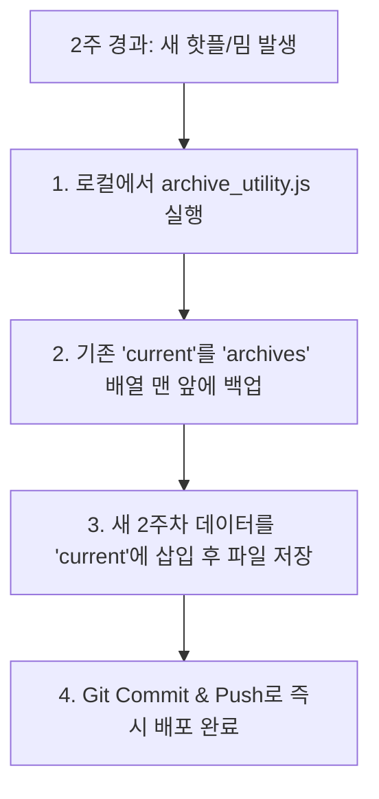

# BKK BEYOND | 2주 주기 컨텐츠 업데이트 & 아카이빙 백엔드 유틸리티 가이드

본 문서는 **제안 1(Git 기반 정적 JSON 아키텍처)**을 원활하게 운영하기 위해 설계된 로컬 백엔드/유틸리티 자동화 스크립트 명세서입니다. 

이 스크립트를 사용하면 2주마다 현재의 핫플레이스/밈 컨텐츠를 자동으로 아카이브 배열로 넘기고, 새로운 테마와 장소 데이터로 교체하는 작업을 실수 없이 자동화할 수 있습니다.

---

## 1. 아키텍처 워크플로우 (Content Lifecycle)

2주 주기의 데이터 갱신 및 보존 흐름은 다음과 같습니다.



---

## 2. 자동화 유틸리티 코드 (Node.js Script)

이 스크립트는 프로젝트 루트에 `scripts/archive_utility.js`라는 파일로 저장하여 사용할 수 있는 완벽히 구현된 Node.js 백엔드 유틸리티 코드입니다.

```javascript
/**
 * BKK BEYOND - Bi-weekly Content Archiving Utility
 * Run with: node scripts/archive_utility.js
 */

const fs = require('fs');
const path = require('path');

// 경로 설정
const dbPath = path.join(__dirname, '../data/bkk_content.json');

// 1. 기존 데이터 읽기
if (!fs.existsSync(dbPath)) {
  console.error("❌ 에러: 데이터베이스 파일(data/bkk_content.json)을 찾을 수 없습니다.");
  process.exit(1);
}

const dbRaw = fs.readFileSync(dbPath, 'utf8');
const db = JSON.parse(dbRaw);

console.log("📂 기존 Curation Database를 로드했습니다.");
console.log(`- 현재 버전: ${db.current.version}`);
console.log(`- 백업된 아카이브 개수: ${db.archives.length}개\n`);

// 2. 현재 버전을 아카이브로 복사 & 추가
const oldCurrent = JSON.parse(JSON.stringify(db.current)); // Deep Copy

// 기존 아카이브에 동일 버전이 이미 존재한다면 예방 차원에서 필터링 제거
db.archives = db.archives.filter(item => item.version !== oldCurrent.version);

// 아카이브 배열 맨 앞에 기존 current 데이터 추가 (최신순 정렬 유지)
db.archives.unshift(oldCurrent);
console.log(`✨ 기존 버전 [${oldCurrent.version}]이 archives 배열에 안전하게 백업되었습니다.`);

// 3. 새로운 2주차 콘텐츠 정의 (이 자리에 2주마다 새 콘텐츠를 작성해 넣습니다)
const newVersion = "2026-06-15"; // 예시: 다음 2주 뒤 날짜
const newTheme = {
  ko: "6월 2주차: 숨겨진 차이나타운 심야 위스키 바와 에까마이 바이닐 투어",
  en: "June 2nd Week: Hidden Chinatown Late-night Whisky Bars & Ekkamai Vinyl Tour",
  th: "มิถุนายน สัปดาห์ที่ 2: บาร์วิสกี้ลับเยาวราชและทัวร์แผ่นเสียงเอกมัย"
};

// 새 라운드 번역 정보
const newTranslations = {
  ko: {
    "curation.songwatTagline": "Chinatown Secret Alley",
    "curation.songwatTitle": "소이 나나 뒷골목의 어두운 스피크이지",
    "curation.songwatDesc": "야오와랏 차이나타운의 번화가를 한 블록 벗어난 소이 나나(Soi Nana) 골목은, 낡은 중국 약재상 건물 뒤편으로 간판 없는 어두운 바들이 문을 열기 시작하는 방콕 밤문화의 숨은 중심지입니다.",
    "curation.songwatSpot1Title": "Asia Today",
    "curation.songwatSpot1Desc": "태국 전역에서 수집한 야생 꿀과 현지 허브로 독창적인 칵테일을 만드는 하이엔드 믹솔로지 바.",
    "curation.songwatSpot2Title": "Wallflowers Upstairs",
    "curation.songwatSpot2Desc": "꽃집 옥상을 아기자기하게 개조해 정원 속에서 라이브 재즈 음악을 듣는 옥상 루프탑 라운지.",
    "curation.songwatSpot3Title": "Pijiu Bar (피주 바)",
    "curation.songwatSpot3Desc": "홍콩 영화 세트장에 들어온 듯한 빈티지 조명 아래서 수입 수제 맥주를 맛보는 곳.",
    "curation.songwatMediaTag": "Soi Nana Speakeasy",
    "curation.songwatMediaCaption": "간판이 없는 어두운 문 뒤로 열리는 완전히 새로운 믹솔로지 세계"
  },
  en: {
    "curation.songwatTagline": "Chinatown Secret Alley",
    "curation.songwatTitle": "Dim Speakeasies in Soi Nana Back Alleys",
    "curation.songwatDesc": "Just one block away from the busy Yaowarat street, Soi Nana Chinatown is the hidden center of Bangkok nocturnal scene where vintage Chinese herbal shops transform into signless cocktail chambers.",
    "curation.songwatSpot1Title": "Asia Today",
    "curation.songwatSpot1Desc": "An intimate mixology bar showcasing wild honey and native botanicals from all over Thailand.",
    "curation.songwatSpot2Title": "Wallflowers Upstairs",
    "curation.songwatSpot2Desc": "A dreamy garden-like rooftop lounge hidden above a local florist shop featuring live acoustic jazz.",
    "curation.songwatSpot3Title": "Pijiu Bar",
    "curation.songwatSpot3Desc": "Enjoy premium craft beers under warm retro lighting resembling an old Hong Kong film set.",
    "curation.songwatMediaTag": "Soi Nana Speakeasy",
    "curation.songwatMediaCaption": "A completely new mixology world opening behind signless doors"
  },
  th: {
    "curation.songwatTagline": "Chinatown Secret Alley",
    "curation.songwatTitle": "บาร์ลับในตรอกซอกซอยซอยนานา เยาวราช",
    "curation.songwatDesc": "เพียงหนึ่งบล็อกจากถนนเยาวราชที่คึกคัก ซอยนานาคือศูนย์กลางยามค่ำคืนที่ซ่อนอยู่ ซึ่งร้านขายยาจีนโบราณจะกลายร่างเป็นบาร์ค็อกเทลไร้ป้ายไฟ",
    "curation.songwatSpot1Title": "Asia Today",
    "curation.songwatSpot1Desc": "บาร์มิกโซโลจีขนาดกะทัดรัดที่นำเสนอน้ำผึ้งป่าและสมุนไพรท้องถิ่นจากทั่วประเทศไทย",
    "curation.songwatSpot2Title": "Wallflowers Upstairs",
    "curation.songwatSpot2Desc": "รูฟท็อปเลานจ์บรรยากาศสวนสวยในฝันที่ซ่อนตัวอยู่เหนือร้านดอกไม้ท้องถิ่น",
    "curation.songwatSpot3Title": "Pijiu Bar",
    "curation.songwatSpot3Desc": "เพลิดเพลินกับคราฟต์เบียร์ระดับพรีเมียมภายใต้แสงไฟเรโทรที่อบอุ่นคล้ายกับฉากหนังฮ่องกงเก่า"
  }
};

// 4. db.current 오브젝트 갱신
db.current = {
  version: newVersion,
  theme: newTheme,
  translations: newTranslations
};

console.log(`🆕 새로운 버전 [${newVersion}] 콘텐츠로 current 노드가 업데이트되었습니다.`);

// 5. 파일에 다시 쓰기
fs.writeFileSync(dbPath, JSON.stringify(db, null, 2), 'utf8');
console.log("💾 data/bkk_content.json 파일이 성공적으로 기록 및 업데이트 완료되었습니다! (SUCCESS)");
```

---

## 3. 유틸리티 실행 방법 (How to Run)

본 백엔드/유틸리티 자동화 도구를 실행하는 명령어 순서입니다.

1. **디렉토리 생성 및 코드 작성**:
   프로젝트 루트 아래 `scripts` 폴더를 생성하고 위의 유틸리티 자바스크립트 코드를 `archive_utility.js` 파일로 복사해 둡니다.

2. **유틸리티 가동**:
   터미널에서 아래 명령어를 수행합니다:
   ```bash
   node scripts/archive_utility.js
   ```
   > **결과 예시:**
   > ```text
   > 📂 기존 Curation Database를 로드했습니다.
   > - 현재 버전: 2026-06-01
   > - 백업된 아카이브 개수: 1개
   > 
   > ✨ 기존 버전 [2026-06-01]이 archives 배열에 안전하게 백업되었습니다.
   > 🆕 새로운 버전 [2026-06-15] 콘텐츠로 current 노드가 업데이트되었습니다.
   > 💾 data/bkk_content.json 파일이 성공적으로 기록 및 업데이트 완료되었습니다! (SUCCESS)
   > ```

3. **HTML 버튼 대응**:
   새로운 아카이브가 등록되면, `index.html` 파일의 타임머신 다이얼 영역에 새로운 날짜의 버튼 한 줄만 추가해 주면 모든 연동이 완벽하게 끝납니다:
   ```html
   <button class="time-btn" data-ver="2026-06-15">2026.06.15 <span>[Current]</span></button>
   <button class="time-btn active" data-ver="2026-06-01">2026.06.01 <span>[Archive]</span></button>
   ```

이 설계를 통해 Git 커밋 단 한 번만으로 과거 아카이브 이력을 체계적으로 유실 없이 누적 보관하는 동시에 힙플레이스 큐레이션을 초스피드로 관리하실 수 있습니다!
